# Kubernetes 權威指南精華學習指南

## 閱讀定位與版本基準

這份指南把《Kubernetes權威指南：從Docker到Kubernetes實踐全接觸》的 12 章與附錄，整理成「理解原理 → 看懂關係 → 動手驗證 → 判讀故障」的繁體中文教材。章節順序對照原書，解釋、圖解與練習為重新編寫，適合有 VM、Linux、Windows 與基礎 OKD 操作經驗的基礎架構工程師。

原書版權頁記載出版時間為 **2021 年 6 月**；內容簡介表示涵蓋 **Kubernetes 1.0～1.19**。本指南的原書頁碼均指附件 PDF 閱讀器的頁碼，並非紙本頁碼。新版資訊查核日為 **2026 年 9 月 16 日**；官方發行頁目前列出 1.37、1.36、1.35 為維護分支。企業 OKD／OCP 應依發行版相容矩陣與實際版本操作，不直接套用上游最新版本。[官方版本資訊](https://kubernetes.io/releases/)

指南覆蓋原書全部第二層節目錄，並深入解釋工作上最常使用的觀念。實驗提供預期結果與失敗判讀；範例已做檔案與結構檢查，但未連線到你的叢集執行，不能視為已在公司環境驗收。部分原書指令以圖片儲存；本指南採重新撰寫的範例，避免 OCR 破壞 YAML 縮排。

## 全書地圖

| 章 | 原書 PDF 頁碼 | 你要回答的問題 | 學完的證據 |
|---|---|---|---|
| 1 入門 | 13–83 | Kubernetes 到底管理什麼 | 說出 Deployment、Pod、Service 的關係 |
| 2 安裝設定 | 84–196 | 叢集如何建立、如何辨識環境 | 查出版本、執行環境、網路與儲存元件 |
| 3 Pod | 197–423 | 應用怎麼啟動、更新、擴縮 | 完成部署、健康檢查、故障版本回滾 |
| 4 Service | 424–571 | 如何穩定找到不斷重建的 Pod | 從 DNS、Service 追到 EndpointSlice |
| 5 核心元件 | 572–625 | apply 之後究竟誰做了什麼 | 依症狀判斷 API、排程或節點問題 |
| 6 安全 | 626–753 | 誰可以做什麼、Pod 能做什麼 | 建立唯讀權限並驗證禁止刪除 |
| 7 網路 | 754–955 | 封包如何跨節點、如何隔離 | 驗證允許與禁止的連線 |
| 8 儲存 | 956–1108 | Pod 消失後資料如何留下 | PVC 寫入、重建 Pod、驗證資料 |
| 9 開發 API | 1109–1202 | 如何讓平台自動管理新資源 | 分清 CRD、CR、Controller、Operator |
| 10 維運 | 1203–1477 | 如何管理容量、日誌、維護與備份 | 做出可用性與復原驗收表 |
| 11 故障排除 | 1478–1498 | 如何縮小故障範圍 | 修復 selector、image 與 probe 故障 |
| 12 新功能 | 1499–1562 | Windows、GPU、VPA 今天怎麼用 | 能判斷功能是否適合自己的叢集 |
| 附錄 A | 1563–1678 | 設定參數該查哪裡 | 使用目前版本的 help 與設定 API |

**建議學習順序：**第 1 章 → 第 2 章的環境辨識 → 第 3、4 章 → 第 5、7、8 章 → 第 6、10、11 章 → 第 9、12 章。先建立一個能服務的應用，再理解它的內部機制。

## 先修正舊版資訊

| 原書涉及的舊資訊 | 今日應採用的觀念或做法 | 影響章節 |
|---|---|---|
| Docker 與 kubelet 內建 dockershim | dockershim 自 1.24 移除；節點使用相容 CRI 的 containerd、CRI-O 等。Docker 建出的相容映像仍可使用 | 2、5、7 |
| 舊 yum／apt 套件來源 | 新版使用 `pkgs.k8s.io` 對應 minor 分支；不要原封貼上 1.19 安裝腳本 | 2 |
| RC 作為主要應用管理方式 | 新的無狀態長駐服務優先用 Deployment；RC 作歷史背景理解 | 1、3 |
| beta Ingress／CronJob／HPA API | 使用 `networking.k8s.io/v1`、`batch/v1`、`autoscaling/v2`，並檢查欄位變更 | 3、4 |
| PodSecurityPolicy | 1.25 移除；學 Pod Security Admission／Standards。OKD 另有 SCC | 6 |
| 長效 ServiceAccount Secret Token | 預設轉向短效、輪替的投射 Token；1.24 起不再自動產生舊式永久 Token | 6 |
| 以 Endpoints 為主要後端清單 | 日常診斷優先查 `discovery.k8s.io/v1` EndpointSlice；Endpoints 自 1.33 起棄用 | 4、11 |
| 以 Ingress NGINX 作新建環境預設選項 | 社群 Ingress NGINX 公告 2026 年 3 月停止維護；評估受維護實作或 Gateway API。Ingress API 本身仍存在 | 4 |
| GlusterFS 內建 Volume 與 Heketi 教學 | in-tree GlusterFS driver 自 1.26 移除；改學實際平台支援的 CSI 與 StorageClass | 8 |
| IPv4／IPv6 雙棧仍為 Alpha | 自 1.23 穩定；能否使用仍取決於叢集、CNI、底層路由 | 7 |
| Windows 只支援 Server 2019 | 上游目前 1.37 文件列 Server 2022／2025；必須依部署版本及映像相容性檢查 | 12 |
| 垂直調整資源必然重建 Pod | 原地 CPU／記憶體調整自 1.35 穩定；VPA 更新模式與支援版本仍需確認 | 12 |
| 每次擴容都等於 VM 加 CPU／RAM | HPA 增減 Pod、VPA 調整 Pod 資源、Node Autoscaler 增減節點，三者不同 | 3、10、12 |

依據：[Service 與端點演進](https://kubernetes.io/docs/concepts/services-networking/service/)、[API 遷移](https://kubernetes.io/docs/reference/using-api/deprecation-guide/)、[執行環境](https://kubernetes.io/docs/setup/production-environment/container-runtimes/)、[安裝來源](https://kubernetes.io/docs/setup/production-environment/tools/kubeadm/install-kubeadm/)、[Ingress NGINX 公告](https://kubernetes.io/blog/2025/11/11/ingress-nginx-retirement/)、[1.26 移除項目](https://kubernetes.io/blog/2022/12/09/kubernetes-v1-26-release/)。各章另附對應來源。

## 舊 YAML 換新版時要看欄位

| 資源 | 今日常用 API | 必須一起檢查的地方 |
|---|---|---|
| Deployment、StatefulSet、DaemonSet | `apps/v1` | selector 與 template labels 必須匹配 |
| Ingress | `networking.k8s.io/v1` | pathType、backend.service.name 與 backend.service.port，並確認實作 |
| CronJob | `batch/v1` | schedule、concurrencyPolicy、suspend 與 Job template |
| HPA | `autoscaling/v2` | metrics[].resource.target 的 type 與 averageUtilization 等結構 |
| PDB | `policy/v1` | selector 要明確；空的 `{}` 會選中 Namespace 內所有 Pod |
| CRD | `apiextensions.k8s.io/v1` | versions、schema、scope 等必要結構 |
| EndpointSlice | `discovery.k8s.io/v1` | addressType、ports、endpoints 與 conditions |

改 apiVersion 不等於完成移轉。先查 `kubectl explain`，再做 server dry-run，最後在測試範圍驗證行為。[API 遷移指南](https://kubernetes.io/docs/reference/using-api/deprecation-guide/)

# 第 1 章 Kubernetes 入門

**來源：PDF 13–83。核心問題：如何讓一個應用持續維持你指定的狀態？**

## 原書各節精華

| 原書節 | 你應學會的重點 | 應用例子 |
|---|---|---|
| 1.1 了解 Kubernetes | 以 API 物件描述期望狀態，再由控制器持續協調 | 宣告網站應有 3 個副本 |
| 1.2 為什麼要用 Kubernetes | 適合需要部署一致性、擴縮與自動修復的服務；也增加平台維護成本 | 多個團隊共用一套部署標準 |
| 1.3 從簡單例子開始 | 原書 Tomcat＋MySQL 展示應用層與資料層的連線 | 改用 NGINX 練習，再延伸到 API＋資料庫 |
| 1.4 概念與術語 | 按運算、網路、儲存、安全分類理解資源關係 | Pod 執行、Service 找到它、PVC 保存資料 |

## 最重要的思考方式

傳統 VM 作業常以「登入主機 → 安裝程式 → 啟動服務」為中心。Kubernetes 的作業單位是可重新建立的資源物件。你提供 `spec`，平台觀察 `status`，控制器持續縮小差距。一次 apply 成功只表示請求被接受，並不表示應用已可服務。

例如 `replicas: 3` 的意思是持續維持三個副本。刪掉其中一個 Pod，ReplicaSet 控制器通常會建立替代 Pod。替代 Pod 的名稱、UID、IP 與所在節點都可能不同；應用不能假設這些資訊永遠固定。

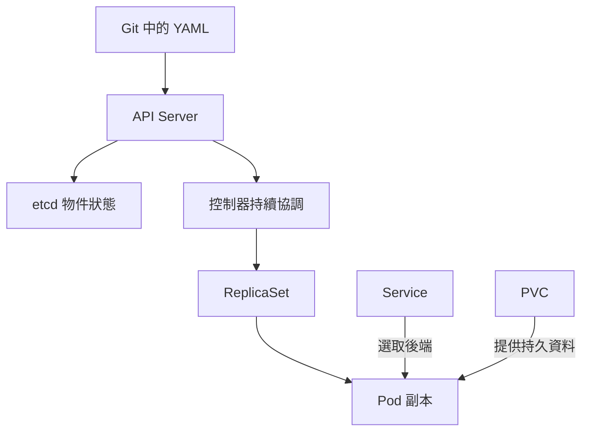

## 資源角色對照

| 物件 | 白話定位 | 容易誤會的地方 |
|---|---|---|
| Node | 提供運算能力的主機，可能是 VM 或實體機 | Node 本身不是 Pod |
| Pod | 一組共用網路與可共用 Volume 的容器 | Pod 可以有多個容器，不等於 VM |
| Deployment | 管理無狀態服務的副本與版本 | 真正執行程式的是 Pod 內的容器 |
| ReplicaSet | 維持所需 Pod 副本數 | 通常交給 Deployment 管理 |
| Service | 為一組後端提供穩定的存取抽象 | 不負責啟動或修復 Pod |
| Namespace | API 資源的名稱與管理範圍 | 單獨建立 Namespace 不等於網路隔離 |
| Label／Selector | 資源分類與選取規則 | 改錯標籤可能讓 Service 找不到後端 |
| ConfigMap／Secret | 設定／敏感資料注入 | 不會自動讓程式重新讀取設定 |
| PV／PVC | 實際儲存資源／使用者的儲存需求 | 不能保證資料庫應用一致性 |

**VM 與 Kubernetes 可以共存。**例如在 vSphere／Proxmox 的 VM 上建立 Kubernetes Node，再在 Node 內執行 Pod。Microservice 是應用拆分方式，並非某一種 Kubernetes 資源；單體應用也能用 Deployment 部署。

## 練習與自我檢查

做完後面的實驗 A，查 `kubectl -n k8s-book-lab get deploy,rs,pods,svc`。你應能沿著 Deployment → ReplicaSet → Pod 找到擁有關係，再用 Service 的 selector 找到相同標籤的 Pod。

**問題：**Service 名稱不變，後端 Pod 全部換新，為何用戶端仍有機會正常連線？

**答案：**Service 提供穩定名稱與虛擬入口，後端清單隨 EndpointSlice 更新；仍須考慮 Ready 狀態、連線中斷、重試與更新時的可用容量。

# 第 2 章 安裝設定與環境辨識

**來源：PDF 84–196。核心問題：你的叢集由哪些元件組成，哪些設定由誰管理？**

## 原書各節精華

| 原書節 | 精華與新版讀法 |
|---|---|
| 2.1 系統要求 | 確认 CPU／RAM、OS、時間、DNS、IP 規劃、執行環境與連線需求；不用舊 CentOS 7＋Docker 19.03 作新建基準 |
| 2.2 kubeadm | 理解 init、join、kubeconfig、CNI、驗收；依目標版本官方安裝步驟建立獨立實驗叢集 |
| 2.3 二進位高可用 | 理解 CA、憑證、API 負載平衡、etcd quorum；手動組裝不是學習工作負載的先決條件 |
| 2.4 私有映像庫 | 區分拉取權限、Registry TLS 信任、映像位置；Harbor Robot 不等於叢集管理帳號 |
| 2.5 版本升級 | 先查相容性與 API，再備份、按支援順序升級與驗收 |
| 2.6 CRI | kubelet 經標準介面要求 runtime 啟停容器；理解與 CNI／CSI 的分工 |
| 2.7 kubectl | 熟悉 get、describe、logs、exec、apply、diff、rollout、explain |

## 先做環境盤點

以下皆為查詢；沒有叢集層權限時，記錄 Forbidden 並由平台管理員提供對應資訊。

```bash
kubectl config current-context
kubectl version
kubectl get nodes -o wide
kubectl get nodes -o custom-columns=NAME:.metadata.name,VERSION:.status.nodeInfo.kubeletVersion,RUNTIME:.status.nodeInfo.containerRuntimeVersion
kubectl api-resources
kubectl get storageclass
kubectl get pods -n kube-system
```

OKD 額外查看：

```bash
oc version
oc whoami
oc project
oc get clusterversion
oc get clusteroperators
oc get network.config.openshift.io cluster -o yaml
```

不要只依書中的版本選 YAML：`kubectl api-resources` 告訴你叢集實際有哪些物件；`kubectl explain deployment.spec` 告訴你欄位結構。

## 控制平面與節點

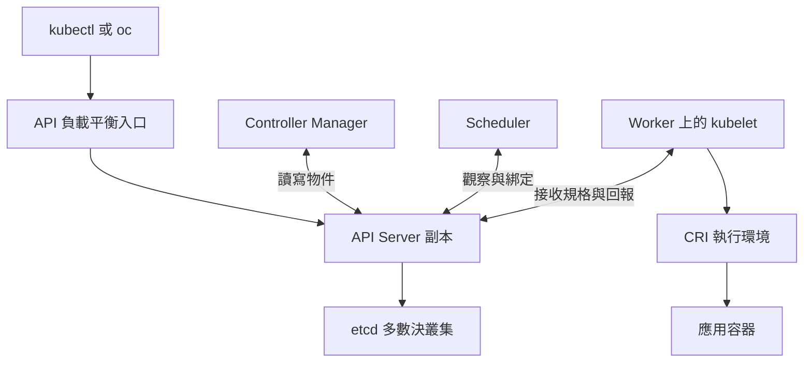

etcd 常見三成員拓撲需要兩票維持多數；失去一個仍可運作，失去兩個便無法正常完成依賴 quorum 的操作。控制平面高可用、應用多副本與儲存高可用需要分別設計，不能互相替代。

## 新建與升級的正確順序

1. 選定平台及支援版本，檢查 runtime、CNI、CSI 的相容性。
2. 規劃 Node IP、Pod CIDR、Service CIDR；避免與公司網段及 VPN 重疊。
3. 確认 DNS、時間同步、Registry 存取與平台需要的連線。
4. 按目標版本安裝控制平面、加入 Worker、安裝 CNI；儲存外掛另外規劃。
5. 驗收 Node Ready、系統元件、DNS、跨節點連線、映像拉取與 PVC。
6. 升級先做 etcd 與應用資料的復原演練，再逐步更新；kubeadm 不支援跨越 minor 版本升級。OKD 使用其平台更新機制，不在節點自行執行 kubeadm 升級。

來源：[kubeadm 安裝](https://kubernetes.io/docs/setup/production-environment/tools/kubeadm/install-kubeadm/)、[升級流程](https://kubernetes.io/docs/tasks/administer-cluster/kubeadm/kubeadm-upgrade/)、[OKD 架構](https://docs.okd.io/latest/architecture/architecture.html)。

## 三個介面不要混在一起

| 介面 | 負責 | 實際例子 |
|---|---|---|
| CRI | 容器執行 | containerd、CRI-O |
| CNI | Pod 網路 | 叢集選用的網路外掛 |
| CSI | 儲存供應、掛載等 | 叢集支援的 CSI 儲存驅動 |

**驗收題：**Harbor 已能登入，但 Pod 拉取失敗，還要查什麼？答案包括 Node 到 Harbor 的 DNS／路由、CA 信任、映像名稱與架構、`imagePullSecrets` 是否在相同 Namespace、Robot 的專案權限。管理者筆電能登入，不能證明每個 Node 都能拉取。

# 第 3 章 深入掌握 Pod

**來源：PDF 197–423。核心問題：一個應用的完整生命週期如何被控制？**

## 原書各節精華

| 原書節 | 你應帶走的重點 |
|---|---|
| 3.1 Pod 定義 | 讀懂 metadata、spec、containers、volumes、securityContext |
| 3.2 基本用法 | 主程序在前景執行；退出後依 restartPolicy 處理，不要把常駐服務寫成跑完就結束的腳本 |
| 3.3 靜態 Pod | 由節點 kubelet 讀取本機 manifest 管理；API 中 mirror Pod 不是一般控制入口 |
| 3.4 共用 Volume | 同 Pod 容器可各自掛載同一 Volume；資料是否持久取決於 Volume 類型 |
| 3.5 ConfigMap | 將環境設定與映像分離；環境變數更新通常要重建容器 |
| 3.6 Downward API | 注入 Pod 名稱、Namespace 等資訊作日誌標籤，不必授予完整 API 權限 |
| 3.7 生命週期 | 區分 Pod phase、容器 state 與 kubectl 顯示的狀態字串 |
| 3.8 健康檢查 | startup、readiness、liveness 解決不同問題 |
| 3.9 調度 | 理解 nodeSelector、親和性、taint、toleration、priority、不同控制器 |
| 3.10 Init Container | 一般 init 先完成，主要容器再啟動；今天另有原生 sidecar 語意 |
| 3.11 更新與回滾 | Deployment 建立新 ReplicaSet；回滾恢復 Pod template，不恢復資料庫資料 |
| 3.12 擴縮 | 手動調副本、HPA 按指標調副本；節點不足仍會 Pending |
| 3.13 StatefulSet 與 MongoDB | 穩定身分與獨立儲存有助資料服務；資料複寫、選主與復原仍由資料庫機制負責 |

**原書需修正的一點：**第 3.3 節提到 kubelet 無法對靜態 Pod 做健康檢查，這不適用於今日版本。官方 kubeadm 的控制平面靜態 Pod manifest 明確包含 liveness、readiness 或 startup probes；靜態 Pod 的主要差異是其管理來源，而不是不能使用探針。[kubeadm 靜態 Pod 定義](https://github.com/kubernetes/kubernetes/blob/master/cmd/kubeadm/app/phases/controlplane/manifests.go)

## 控制器選擇表

| 需求 | 選擇 | 工作例子 |
|---|---|---|
| 多個可替換的 Web／API 副本 | Deployment | NGINX 網站、後端 API |
| 穩定身分、每副本獨立資料 | StatefulSet | 資料庫節點；正式部署還需產品支援方案 |
| 每個符合條件的節點執行代理程式 | DaemonSet | Vector 日誌代理程式 |
| 跑完一項工作 | Job | 一次性資料匯入或驗證 |
| 定時產生工作 | CronJob | 例行報表、備份觸發 |
| 初始化 | initContainers | 檢查設定或準備共用檔案 |

DaemonSet 是每個「符合條件的節點」部署，不是無條件包含所有 control-plane 與 Windows 節點。CronJob 不是保證恰好一次執行的交易系統；工作應設計為可重試且重跑不產生重複副作用。

## 三種探針

| 探針 | 問題 | 失敗後主要結果 | 應用設計 |
|---|---|---|---|
| startupProbe | 啟動完成了嗎 | 超過門檻可觸發容器重啟；成功前暫緩其他兩類探針 | Java 啟動需數十秒時使用 |
| readinessProbe | 現在可接新請求嗎 | Pod Ready 變 False，常規 Service 後端不再把它當 ready 端點 | 短暫過載時避免接新請求 |
| livenessProbe | 程序卡死、需重啟嗎 | 達到門檻觸發重啟處理 | 用本機健康狀態判斷死鎖 |

不要讓 liveness 完全依賴遠端資料庫：資料庫故障時，可能造成所有 Web Pod 一起不斷重啟。Readiness 失敗不會關閉 socket，也不能阻止直接打 Pod IP 的所有流量；既有連線與特殊 Service 設定也要另行考慮。

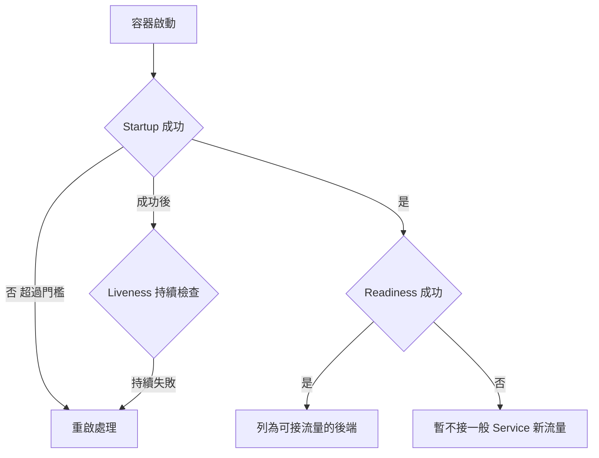

來源：[探針行為](https://kubernetes.io/docs/concepts/workloads/pods/probes/)、[Pod 生命週期](https://kubernetes.io/docs/concepts/workloads/pods/pod-lifecycle/)。

## 調度是條件的交集

Scheduler 先排除不符合條件的 Node，再從候選 Node 評分。`requests`、親和性、Volume 拓撲、taint、資源配額等都可能影響結果。`toleration` 表示「允許進入」，不表示「一定放這裡」；`nodeSelector` 或 affinity 才表達選取偏好／條件。需要分散故障風險時，評估 topology spread 或 pod anti-affinity。

容器在原 Pod 內重啟與建立替代 Pod 是不同事件。Pod 一旦綁定某個 Node，不會把同一個 Pod UID 搬去另一個 Node；所謂重新調度通常是建立新的替代 Pod。

## 更新與擴縮的數字例子

三副本網站設定 `maxUnavailable: 0`、`maxSurge: 1`，更新時理論上可先多開一個新副本，待 Ready 後再移除舊副本。叢集必須有額外資源；readiness 設定正確也不代表更新過程必定零中斷，應用的連線排空仍要設計。

HPA 的基本估算為：目標副本數約等於「向上取整（目前副本 × 目前指標／目標指標）」。若 3 個副本平均 CPU 使用率為 requests 的 90%，目標為 60%，估算為 5 個副本。實際還受缺失資料、容忍範圍、穩定窗口、最大副本等影響。[HPA 原理](https://kubernetes.io/docs/concepts/workloads/autoscaling/horizontal-pod-autoscale/)

| 情境 | 3 個副本，各 request 100m | HPA 目標 60% |
|---|---|---|
| 每副本平均用 30m | 利用率 30% | 基本估算 2 副本 |
| 每副本平均用 60m | 利用率 60% | 基本估算 3 副本 |
| 每副本平均用 90m | 利用率 90% | 基本估算 5 副本 |

以上是教學計算，不是實測效能數據。

**新版補充：**原生 sidecar 可用 `initContainers` 配合 `restartPolicy: Always` 表達；自 1.33 穩定。這與傳統「把兩個長駐容器都放在 containers」在啟動／終止順序上不同。[Sidecar 文件](https://kubernetes.io/docs/concepts/workloads/pods/sidecar-containers/)

**練習：**實驗 A 建站、B 刪除一個副本、C 故障映像與回滾。能解釋為什麼 `Running` 不等於 `Ready`，就掌握了本章的主軸。

# 第 4 章 深入掌握 Service

**來源：PDF 424–571。核心問題：用戶端如何找到會換 IP 的應用？**

## 原書各節精華

| 原書節 | 重點 |
|---|---|
| 4.1 Service 定義 | selector、port、targetPort、type 必須配合 |
| 4.2 原理與類型 | ClusterIP、NodePort、LoadBalancer、ExternalName、Headless 各有用途 |
| 4.3 DNS | 以 CoreDNS 等叢集 DNS 提供名稱解析；不用重建舊 SkyDNS 架構 |
| 4.4 NodeLocal DNSCache | 在節點靠近用戶端的位置快取 DNS；不是所有平台都預設部署 |
| 4.5 Pod DNS 特性 | 區分 Service 名稱、StatefulSet 穩定 DNS 與一般 Pod 的短暫 IP |
| 4.6 Ingress | 用 Host／Path 導流 HTTP(S)，必須搭配控制器或平台路由器 |

## Service 連線路徑

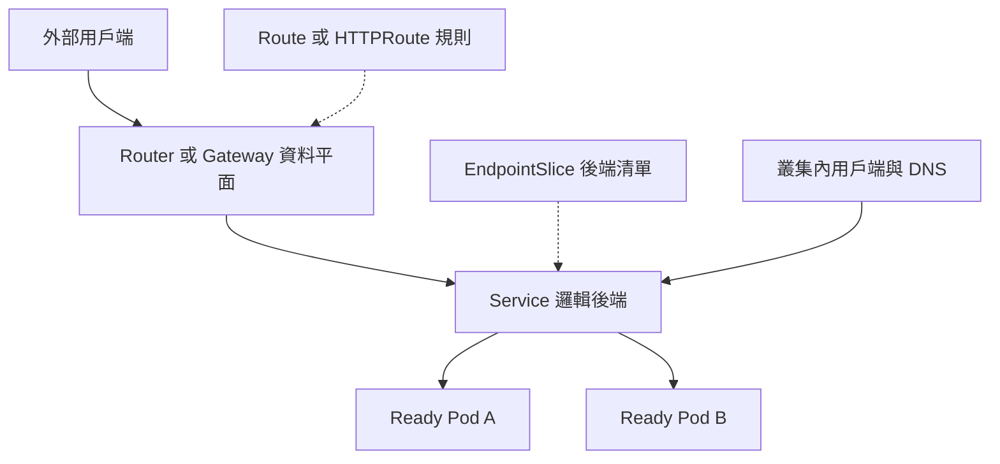

圖中 Service 是邏輯關係：實際 Router／Gateway 可能直接連 Pod 端點，不一定讓封包先經過 ClusterIP。DNS、EndpointSlice 與控制器設定屬於發現／設定過程，也不是每一個 HTTP 封包都要經過 API Server。

| 類型 | 地址或行為 | 典型用途 |
|---|---|---|
| ClusterIP | 叢集內虛擬 IP | API、資料庫內部入口 |
| NodePort | NodeIP 上分配一個 port | 特定入口整合或實驗；需節點可達 |
| LoadBalancer | 請實作供應外部入口 | 需雲端／裸機 LB 整合；物件存在不保證有外部 IP |
| Headless | `clusterIP: None`；DNS 可回覆後端位址 | StatefulSet 服務發現 |
| ExternalName | DNS CNAME 別名 | 對外部 DNS 名稱作別名；不代理封包 |

**例子：**Service `port: 80`、`targetPort: http`，Pod 容器的具名 port `http` 指向 8080。叢集內程式呼叫 `http://web`，實際後端是 Pod 的 8080。`containerPort` 主要是宣告資訊，不會替應用自動啟動監聽。

## DNS 名稱與排錯

同 Namespace 可用 `web`；跨 Namespace 可用 `web.k8s-book-lab`。常見完整名稱為 `web.k8s-book-lab.svc.cluster.local`，但 `cluster.local` 可被平台改成別的叢集網域，不能永遠寫死。

```bash
kubectl -n k8s-book-lab get svc web -o yaml
kubectl -n k8s-book-lab get pods -l app=web --show-labels
kubectl -n k8s-book-lab get endpointslices -l kubernetes.io/service-name=web -o yaml
```

`port-forward svc/web` 成功只能證明被選到的後端與 API 轉送路徑可用，不能完整驗證 ClusterIP、DNS、NetworkPolicy 或外部 Router 路徑。實驗 D 會從另一個 Pod 呼叫 Service，補上這段驗收。

## 新版入口觀念

Ingress `networking.k8s.io/v1` 仍可用，但 API 已凍結。Gateway API 把基礎設施與路由分工成 GatewayClass、Gateway、HTTPRoute；需安裝 CRD 與相容實作，不是只貼 HTTPRoute 就會產生入口。[Ingress 狀態](https://kubernetes.io/docs/concepts/services-networking/ingress/)

社群 `ingress-nginx` 維護終止公告適用於該專案，不等於 NGINX 網頁伺服器被停用，也不能推論所有廠商的 NGINX Ingress 產品都停用。[維護公告](https://kubernetes.io/blog/2025/11/11/ingress-nginx-retirement/)

**OKD 應用：**Route 是平台擴充物件，由 Router 實現。先確認 Service 後端正常，再查 Route 的 Host、TLS termination 與 admitted 狀態。Edge TLS 在 Router 解密；Re-encrypt 再加密連到後端；Passthrough 將 TLS 交給後端終止。

**驗收題：**Service 沒有可用 EndpointSlice 端點，先查 selector 與 Pod labels、Ready 狀態、目標 port。此時先改外部 DNS 通常解決不了根因。

# 第 5 章 核心元件的運作機制

**來源：PDF 572–625。核心問題：一次部署請求如何變成正在執行的容器？**

## 原書各節精華

| 原書節 | 元件責任 | 故障時你可能看到的情況 |
|---|---|---|
| 5.1 API Server | API 入口、驗證、准入與狀態存取；提供 list／watch | kubectl 無法查詢或提交變更 |
| 5.2 Controller Manager | 執行多種控制迴圈，修正實際與期望差距 | 副本缺少卻沒有新的替代 Pod |
| 5.3 Scheduler | 選擇符合條件的 Node 並完成綁定 | Pod Pending，Events 出現 FailedScheduling |
| 5.4 kubelet | 讓已指派的 Pod 在節點上執行並回報狀態 | 已有 nodeName，但容器無法建立 |
| 5.5 kube-proxy | 依 Service／端點資訊配置資料平面規則 | Pod 可直連，Service 路徑異常；需依實際網路實作判斷 |

## 一次 apply 的完整旅程

1. kubectl 將 YAML 對應的 API 請求送到 API Server。
2. API Server 進行身分驗證、授權，以及適用於該操作的准入與資料驗證。
3. 接受後保存物件狀態；控制器透過 API 觀察變化。
4. Deployment 控制器管理 ReplicaSet；ReplicaSet 控制器建立所需 Pod。
5. Scheduler 對尚未綁定的 Pod 選 Node。
6. 目標 Node 的 kubelet 協同 runtime、網路與儲存元件完成啟動。
7. readiness 達到條件，端點資訊更新，資料平面才有可用後端。
8. 控制迴圈持續運作。節點或容器故障後，平台依實際狀態與政策修復。

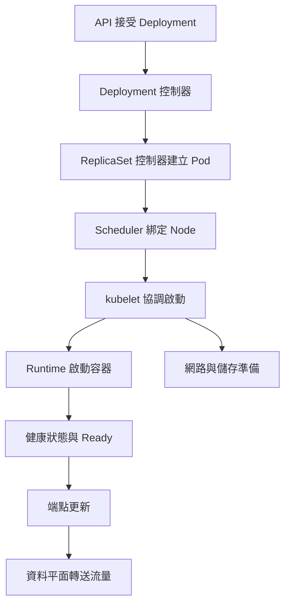

這是責任與事件順序的簡化圖。控制器主要藉由 API 物件互動，不是一串彼此同步呼叫的腳本；網路、掛載、拉取映像等步驟也有實作上的先後與平行處理。

來源：[Kubernetes 核心元件](https://kubernetes.io/docs/concepts/overview/components/)。

## 怎麼從狀態定位元件

| 看到的證據 | 優先調查 | 不足以直接斷言 |
|---|---|---|
| 無法連 API endpoint | DNS、TLS、API LB、API Server | 全部應用都已停止 |
| 沒有 Pod 物件 | Deployment／ReplicaSet Events、quota、admission | runtime 一定壞了 |
| Pod 尚無 nodeName | scheduler、requests、taint、PVC 拓撲 | 增加 CPU limit 一定有效 |
| Pod 已有 nodeName，ImagePullBackOff | 映像、憑證、Registry 網路 | Service selector 有錯 |
| 容器 Ready，Service 不通 | selector、EndpointSlice、CNI／Service 資料平面 | 必須重啟整個叢集 |

**新版讀法：**不要把 kube-proxy 等同永久的 iptables 規則實作；平台可能採其他模式或由 CNI 資料平面承接 Service 功能。先查實際平台配置再查相應規則。

**反向思考：**API Server 暫時不可用時，已在執行的容器與既有資料平面可能仍能服務，但新部署、排程、端點變更及修復能力會受影響。這就是「管理面可用性」與「服務流量可用性」要分開量測的原因。

# 第 6 章 叢集安全機制

**來源：PDF 626–753。核心問題：誰可以操作哪些資源，這些資源又允許做哪些事？**

## 原書各節精華

| 原書節 | 今日學習重點 |
|---|---|
| 6.1 認證 | 憑證、身分提供者、Token 等用來回答「你是誰」 |
| 6.2 授權 | RBAC 用 Role／ClusterRole 與 Binding 定義權限 |
| 6.3 Admission | 對適用的寫入請求修改或驗證物件；不是每個讀取都經同樣流程 |
| 6.4 ServiceAccount | 程式身分；學短效投射 Token，不把人員登入與 Pod 身分混用 |
| 6.5 Secret | 敏感資料的 API 物件；Base64 編碼不能當成加密 |
| 6.6 Pod 安全策略 | 原書 PSP 改學 PSA／PSS；OKD 另學 SCC 與平台政策 |

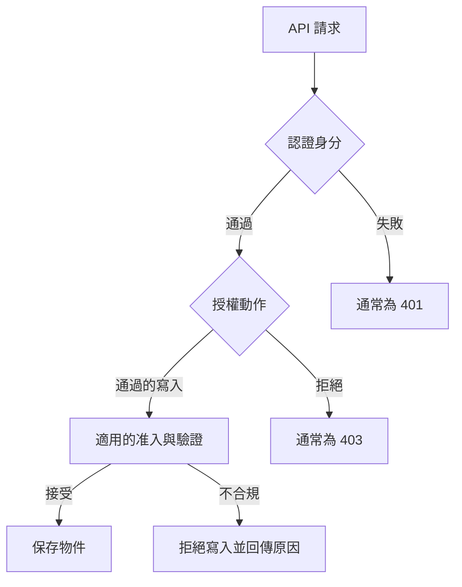

## 權限的四件事

Role 定義某 Namespace 中可做的動作；RoleBinding 把 Role 或 ClusterRole 的規則授予該 Namespace 中的主體。ClusterRole 可以描述叢集資源或可重用規則；ClusterRoleBinding 會給叢集範圍的授權。規則通常是允許的集合，不能依賴額外一條「deny」抵銷已經給出的寬權限。

| 元素 | 例子 | 解釋 |
|---|---|---|
| apiGroups | `""` | 核心 API 群組，例如 Pod |
| resources | `pods`、`pods/log` | 看 Pod 與看日誌是可分開授權的資源 |
| verbs | get、list、watch | 只讀取，不給 delete |
| subject | ServiceAccount `log-reader` | 被授權的程式身分 |

實驗 F 提供唯讀 Role。`kubectl auth can-i` 的結果要以完整身分、Namespace 與動作判斷；使用 `--as` 模擬身分本身也需要 impersonate 權限。

## Secret 與 Token

Secret 避免把密碼寫入映像或一般設定，但能讀 Secret 的主體仍能取得原始內容；預設 etcd 儲存也不等於已加密。應確認靜態加密、RBAC、備份保護及外部 Secret 管理策略。[Secret 文件](https://kubernetes.io/docs/concepts/configuration/secret/)

Pod 不需要呼叫 API 時可設 `automountServiceAccountToken: false`。需要 API 存取時，使用相應的 ServiceAccount 與最小權限；投射 Token 有期限並輪替，不能把讀到的 Token 永久快取。[ServiceAccount 文件](https://kubernetes.io/docs/concepts/security/service-accounts/)

## Pod 安全與 OKD

PSA 可採 enforce、audit、warn 模式，搭配 privileged、baseline、restricted 標準。這類准入控制的功能與 RBAC 不同：某人可能有權建立 Pod，但建立的 Pod 仍因要求 root 或過高權限而被拒絕。[Pod Security Admission](https://kubernetes.io/docs/concepts/security/pod-security-admission/)

OKD 的 SCC 可能限制 UID 範圍、SELinux、capabilities 與 Volume。不要為了讓 NGINX 啟動就立即給 privileged 或 anyuid。先採支援任意 UID、非特權 port 與正確目錄權限的映像；實際允許規則以叢集版本與 SCC 為準。[OKD SCC](https://docs.okd.io/latest/authentication/managing-security-context-constraints.html)

```bash
oc -n k8s-book-lab get pod -l app=web -o jsonpath='{range .items[*]}{.metadata.name}{"\t"}{.metadata.annotations.openshift\.io/scc}{"\n"}{end}'
```

**驗收題：**某人不能 get Secret，但能建立任意 Pod，是否一定無法讀出該 Namespace 的 Secret？不一定；他可能建立掛載 Secret 的 Pod。權限應按整條能力路徑評估，不能只看一項 verb。

# 第 7 章 網路原理

**來源：PDF 754–955。核心問題：名稱解析、封包路徑與允許規則分別在哪一層？**

## 原書各節精華

| 原書節 | 精華與新版讀法 |
|---|---|
| 7.1 網路模型 | Pod 取得可用 IP，Pod 間路徑由平台網路實現，是否允許存取再受政策約束 |
| 7.2 Docker 網路基礎 | 保留 network namespace、veth、bridge、routing、NAT 的基本功 |
| 7.3 Docker 網路實作 | 作容器網路的歷史與 Linux 原理教材，不當成所有 Kubernetes 的實際拓撲 |
| 7.4 Kubernetes 網路實作 | Node、Pod、Service 網段與資料平面要分開看 |
| 7.5 Pod／Service 網路實戰 | 用 Pod IP 與 Service IP 分別測試，縮小故障範圍 |
| 7.6 CNI | 外掛介面與生命週期；今日不要照抄舊 kubelet CNI flags |
| 7.7 開源網路方案 | 按 overlay／原生路由／政策與觀測能力比較；採平台受支援組合 |
| 7.8 NetworkPolicy | L3／L4 允許規則；需要支援政策的網路實作 |
| 7.9 雙棧 | IPv4／IPv6 自 1.23 穩定，但外部路由、DNS、LB 也需支援 |

來源：[雙棧網路](https://kubernetes.io/docs/concepts/services-networking/dual-stack/)。

## 分層診斷

| 層次 | 問題 | 證據 |
|---|---|---|
| 名稱 | `web` 能否解析 | DNS 查詢結果與 resolv.conf |
| 應用 | 容器是否在正確位址和 port 監聽 | 應用日誌、探針、容器內測試 |
| Pod 網路 | 來源 Pod 能否連後端 PodIP:8080 | 同節點與跨節點分別測 |
| Service | ClusterIP:80 能否連 | selector、EndpointSlice、具名 port |
| 入口 | 外部 Host／TLS 是否正確 | Route／Gateway 狀態與 Router 日誌 |
| 政策 | 來源 egress 與目的 ingress 是否允許 | 兩端選到的所有 NetworkPolicy |

同 Pod 的容器共用網路命名空間，可用 localhost 互相存取，也會共用 port 空間。同 Node 的不同 Pod 通常仍有不同網路命名空間，不要把它們當成同一台小主機。

## NetworkPolicy 最常錯的觀念

1. 某方向沒有政策選中 Pod 時，標準 NetworkPolicy 不會因為「沒有 allow」就自動把該方向封鎖。
2. 一旦政策對該方向產生隔離，允許範圍是所有適用政策的聯集；政策順序不產生防火牆式的 first match。
3. 來源 egress 與目的 ingress 兩端都要允許；回應流量的行為由連線處理規則涵蓋。
4. 標準 NetworkPolicy 主要處理 IP／port／協定，不直接以 HTTP 路徑或一般 FQDN 作為規則；產品擴充能力要另外確認。
5. Egress default deny 常連 DNS 都一起封住；放行規則要依實際 CoreDNS／NodeLocal DNS 路徑設計。

來源：[NetworkPolicy 官方語意](https://kubernetes.io/docs/concepts/services-networking/network-policies/)。

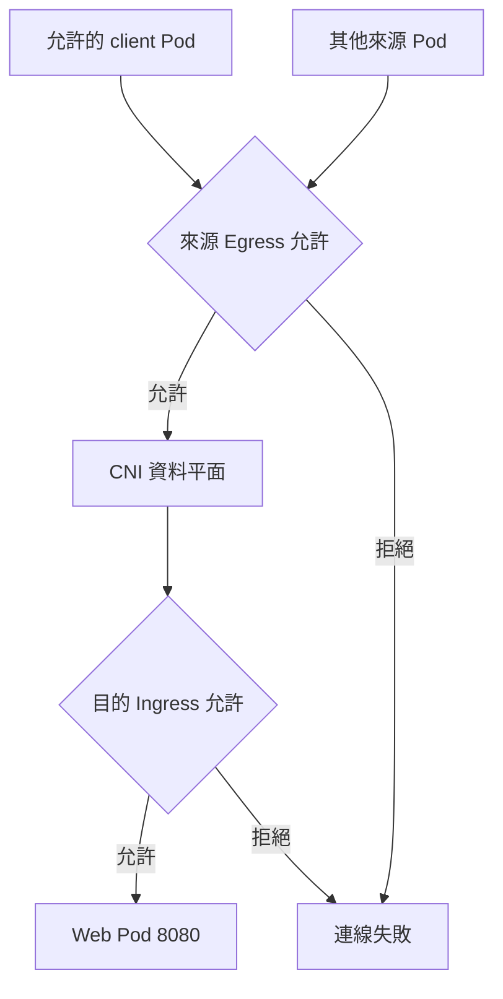

實驗 E 用「只隔離 web ingress」的最小範例，避免同時更改 DNS egress 而混淆結果。成功標準是被標記為 client 的 Pod 能存取、其他 Pod 不行；若兩者都能存取，檢查 CNI 是否實作政策，以及是否有其他更寬的 allow 政策。

**延伸判斷：**`Test-NetConnection` 的 TCP True 只證明測試來源到目標 port 的握手條件成立，不證明 HTTP Host、TLS、登入或應用查詢成功。公司防火牆、Node 網路與 Pod NetworkPolicy 也不是同一套政策。

# 第 8 章 儲存原理與應用

**來源：PDF 956–1108。核心問題：應用換容器、換 Pod、換 Node 後，哪些資料仍存在？**

## 原書各節精華

| 原書節 | 精華與新版讀法 |
|---|---|
| 8.1 Volume | 區分容器可寫層、emptyDir、ConfigMap／Secret 與持久儲存；不是每種 Volume 都跟 Pod 一起失去資料 |
| 8.2 PV／PVC | 申請、綁定、掛載、回收；理解 StorageClass、容量、存取模式與拓撲 |
| 8.3 GlusterFS 動態管理 | 保留「依需求自動供應」概念；替換已移除的 in-tree 驅動範例 |
| 8.4 CSI | 儲存能力由驅動及後端共同提供，快照、擴容與存取模式均需確認支援 |

## 資料生命週期比較

| 資料位置 | 容器重啟 | Pod 被刪除重建 | 換到另一 Node | 適合 |
|---|---|---|---|---|
| 容器可寫層 | 不可依賴保留 | 通常失去 | 不會自動帶走 | 暫存且可重建資料 |
| emptyDir | 同一 Pod 中可保留 | 失去 | 新 Pod 不承接舊內容 | 共用暫存／快取 |
| hostPath | 依主機檔案保留 | 仍在原 Node | 不會自動搬資料 | 特定節點代理程式用途 |
| PVC＋支援後端 | 不因容器重啟直接失去 | 通常保留，仍看回收及控制器政策 | 視驅動、拓撲與掛載限制 | 需要持久資料的工作負載 |

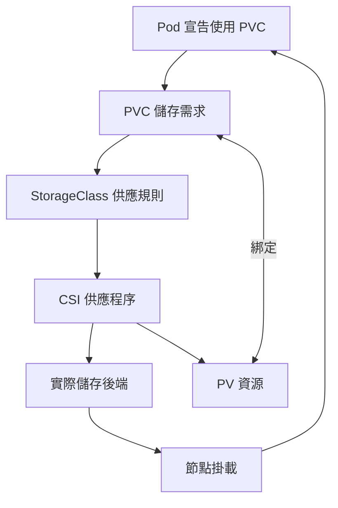

靜態 PV 不一定會經過動態供應程序；圖中是動態供應情境。`WaitForFirstConsumer` 會等知道使用者 Pod 的排程需求後再決定適當儲存位置，因此新 PVC 暫時 Pending 不一定是故障。

## 存取模式與資料庫誤區

| 模式 | 主要含義 | 不代表 |
|---|---|---|
| RWO | 一個 Node 以讀寫模式掛載；同 Node 可能有多 Pod | 永遠只允許一個 Pod |
| RWX | 可由多 Node 讀寫，取決於後端 | 多個資料庫程序能安全共寫同一資料目錄 |
| ROX | 多 Node 以唯讀模式存取的需求 | 任意後端都提供防寫保證 |
| RWOP | 限定一個 Pod 讀寫，需相容 CSI | 自動備份或高可用 |

RWOP 自 1.29 穩定；存取模式的具體限制仍要看官方語意與驅動。[PV 與存取模式](https://kubernetes.io/docs/concepts/storage/persistent-volumes/)

StatefulSet 的 `db-0`、`db-1` 各自通常有獨立 PVC。把副本數改成 3，不會自動變成具備選主與複寫的資料庫叢集。要由資料庫本身或合適的 Operator 完成初始化、複寫、故障切換及一致性控制。

## 擴容與備份

PVC 擴容需要 StorageClass 允許 `allowVolumeExpansion`，且驅動、Volume 類型與檔案系統支援。原理與 VM 的「增加 VMDK → OS 擴 partition／LVM／filesystem」有相似層次，但控制入口與自動化元件不同，不能直接去每個 Pod 執行 `lvextend`。

`reclaimPolicy: Delete` 可能在 PVC 刪除及回收流程中刪除底層資料；Retain 需要管理者後續處理。刪除 Namespace 也會刪掉其中 PVC，因此實驗清理必須只針對實驗資料。

| 要保護的內容 | 備份範圍 | 復原驗收 |
|---|---|---|
| Kubernetes 物件與狀態 | etcd／平台支援的叢集備份 | 物件、控制平面狀態可恢復 |
| 宣告式部署來源 | Git repository 與所需設定 | 能重建資源與版本 |
| 應用資料 | PVC／檔案／資料庫原生備份 | 實際查詢、資料一致性與時間點 |
| 外部依賴 | 憑證、Registry、DNS、外部 DB | 服務重新對外可用 |

**etcd 備份不包含所有 PVC 中的業務資料。**儲存快照也不自動等於應用一致性備份；應依資料庫與 CSI 支援做 quiesce 或原生備份及還原測試。

**練習：**實驗 G 先寫入一行文字，再刪掉使用 PVC 的 Pod，重建後讀回。這證明的是該情境的持久性；不能據此宣稱已通過 Node 故障、站點 DR 或備份復原驗收。

# 第 9 章 API 開發與 Operator

**來源：PDF 1109–1202。核心問題：如何把手動維運經驗轉成持續運作的控制器？**

## 原書各節精華

| 原書節 | 精華與新版讀法 |
|---|---|
| 9.1 REST | 用 HTTP 介面對資源操作；理解物件、集合、動作與回應 |
| 9.2 Kubernetes API | 核心 `/api` 與其他群組 `/apis`；list／watch、metadata、spec、status |
| 9.3 Fabric8 | Java 封裝用戶端仍是可選路徑；依實際叢集相容性選依賴，不照抄舊 Jar 清單 |
| 9.4 API 擴充 | CRD 定義新類型，CR 是實例；Controller 才會讓其產生自動管理行為 |

## 四個角色的關係

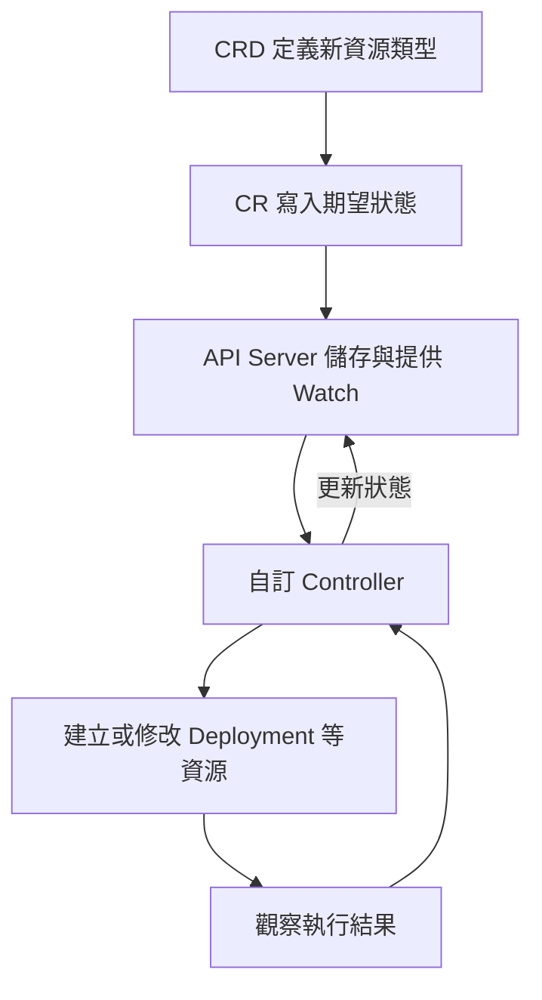

CRD 比較像新增資料結構與 API；只建立 CRD 不會自動啟動資料庫。Operator 是用 Controller 與相關資源，把某個領域的管理知識寫成軟體，例如版本相容檢查、備份、憑證輪替或故障處理。[Custom Resources](https://kubernetes.io/docs/concepts/extend-kubernetes/api-extension/custom-resources/)

## 用唯讀 API 開始

```bash
kubectl get --raw /version
kubectl get --raw /api/v1/namespaces/k8s-book-lab/pods
kubectl get --raw /apis/apps/v1/namespaces/k8s-book-lab/deployments
kubectl -n k8s-book-lab get deployment web -o yaml
```

注意 `metadata.resourceVersion` 可參與版本與 watch 語意，但不是一般時間戳；`status` 是控制器回報的觀察結果，不要把手改 status 當成真正修復。

## 寫控制器時的三個習慣

- **可重複執行：**同一個 reconcile 跑十次，結果不應多建十套資料庫。
- **接受延遲與衝突：**API 回應、實際啟動與 watch 事件存在時間差，更新可能遇到衝突。
- **提供可診斷狀態：**使用 conditions、reason、message 說明成功或卡住的原因，而非只寫一個布林值。

**你的工作連結：**Trivy Operator 的漏洞報告、AWX Operator 的自訂資源、Argo CD Application 都是理解這套模式的好例子，但它們的 CRD 不互通。`the server doesn't have a resource type` 表示 API 類型不存在或名稱／群組不對；`No resources found` 則可能只是此範圍沒有實例。這兩者的排查方向不同。

```bash
kubectl api-resources | grep -i vulnerability
kubectl get crd | grep -i trivy
```

以上是篩選資源類型，不是假設每個叢集都有相同簡稱或 Namespace。若第一步沒有對應 API，就查安裝狀態與 CRD；若 API 存在但沒有報告，就查 Operator 範圍、RBAC、掃描 Job 與日誌。

**驗收題：**CR 已建立卻沒有 Deployment，可能是 Controller 沒裝、未運作、無權限、CR 無效或前置條件不滿足；不是「CRD 會自己修復」。

# 第 10 章 維運管理

**來源：PDF 1203–1477。核心問題：服務上線之後，如何長期維持可用、可查與可恢復？**

## 原書各節精華

| 原書節 | 學習重點與實際用途 |
|---|---|
| 10.1 Node 管理 | cordon 停止一般新排程、drain 驅逐、uncordon 恢復；Node 刪除不是 VM 關機 |
| 10.2 Label | 分類、selector、排程依據；修改前檢查哪些資源引用 |
| 10.3 Namespace | 搭配 RBAC、Quota、NetworkPolicy 管理多團隊 |
| 10.4 資源管理 | requests、limits、QoS、LimitRange、ResourceQuota 與進階 CPU／NUMA 管理 |
| 10.5 資源壓力驅逐 | 區分 OOMKilled、Evicted、節點 MemoryPressure／DiskPressure |
| 10.6 PDB | 控制經 Eviction API 進行的自願中斷，不保證抵擋所有刪除及故障 |
| 10.7 監控 | Metrics API 支援即時資源資訊；長期趨勢、告警與 SLO 另需監控系統 |
| 10.8 日誌 | stdout／stderr、節點代理程式、集中儲存與查詢 |
| 10.9 審計 | 記錄誰在何時對哪些 API 物件做了什麼；敏感內容與保留政策須設計 |
| 10.10 Dashboard | UI 是 API 的操作入口，仍受身分與權限限制；OKD 可用既有 Console |
| 10.11 Helm | Chart 管理可參數化的多資源部署；以實際 Helm 版本驗證 chart 與升級行為 |

## requests 與 limits

| 欄位 | 主要作用 | 常見判斷錯誤 |
|---|---|---|
| CPU request | 排程計算與 CPU 競爭時的分配基準 | 不等於固定佔滿一顆 CPU |
| CPU limit | 限制 CPU 使用，可能發生 throttling | 增加副本前也要看每個副本是否被限速 |
| Memory request | 排程與資源管理依據 | 記憶體實際使用可以超過 request |
| Memory limit | 超出時可能因 OOM 被終止 | 不保證恰好到門檻瞬間就結束 |
| ephemeral-storage | 容器可寫層、日誌等本地暫存需求 | PVC 有空間不代表 Node 磁碟不會滿 |

來源：[資源管理](https://kubernetes.io/docs/concepts/configuration/manage-resources-containers/)。

以 Node 可分配 4 CPU、8 GiB 為例，若每個 Pod request 為 500m、1 GiB，單看這兩種資源最多約 8 個；還要扣除現有 Pod、DaemonSet、其他限制及排程條件。Scheduler 看 request 是否放得下，不是看到目前 CPU 很閒就忽略 request。

QoS 常見 Guaranteed、Burstable、BestEffort。它們有助理解資源與驅逐，但不能直接用「Guaranteed 永不被殺」判斷。CPU Manager 的專用 CPU 與 Topology Manager 的 NUMA 對齊屬平台進階設定，適合延遲敏感或特殊硬體工作負載，不是所有 Web Pod 的預設需求。

## PDB 與維護

三副本、`minAvailable: 2` 的 PDB 可以限制尊重 Eviction API 的維護同時造成過多中斷。它不能防止節點突然斷電，也不限制 Deployment 自己的 rolling update；更新可用性由 Deployment 的策略控制。直接 delete Pod 也不能視為一定受 PDB 保護。[Disruptions 與 PDB](https://kubernetes.io/docs/concepts/workloads/pods/disruptions/)

實驗叢集管理者可依順序演練：檢查副本／容量／PDB → cordon → drain → 維護 → 檢查 Node Ready → uncordon → 應用驗收。不要在未確認資料用途時加入 `--delete-emptydir-data` 或 `--force` 來繞過 drain 的阻擋。

## 日誌架構連結到 Vector 與 VictoriaLogs

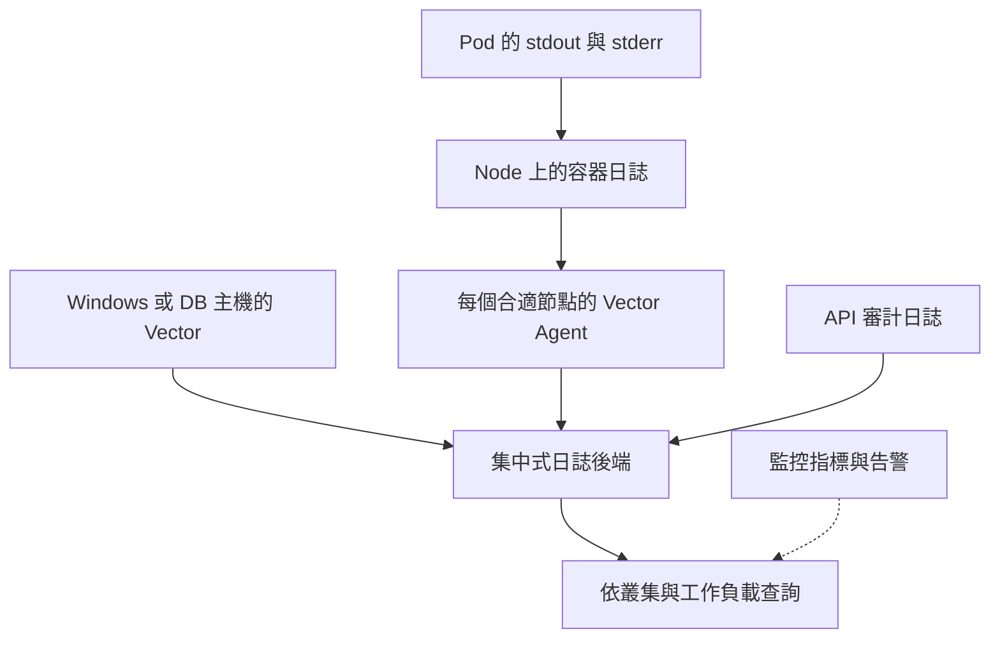

這是建議整合架構，不表示目前公司已部署。Kubernetes 中的 Vector 常以 DaemonSet 蒐集容器日誌；Windows 主機上的 Vector 則可繼續作 OS 服務。兩者可流向同一後端，但欄位模型應一致，例如 `cluster`、`namespace`、`pod`、`container`、`node`、`app`、`environment`。

容器日誌收集可能需讀取 Node 上的路徑並查詢 Kubernetes metadata，因此必須配合平台支援的 Volume 與 RBAC／SCC。應設計磁碟緩衝、後端中斷時的背壓、輪替、保留天數與敏感資料過濾。[Kubernetes 日誌架構](https://kubernetes.io/docs/concepts/cluster-administration/logging/)

| 資料 | 主要回答 | 例子 |
|---|---|---|
| Metrics | 何時、多少、是否異常 | CPU、延遲、錯誤率、可用副本 |
| Logs | 當時程式說了什麼 | 資料庫連線失敗、HTTP 錯誤 |
| Events | 平台對資源做了什麼 | 排程失敗、拉取失敗、探針失敗 |
| Audit | 誰對 API 做了什麼 | 哪個帳號刪除 Deployment |
| Traces | 一個請求跨服務花在哪裡 | Web → API → DB 的耗時 |

Events 可能過期，`kubectl logs --previous` 也不等於永久歷史資料庫。重要事件與日誌須另行保存。

## Helm 與 GitOps

Helm 將 values 與 templates 產生多個 Kubernetes 物件；Release 記錄部署實例。升級前先查看渲染結果與差異，並理解 chart 的 hooks、CRD、PVC 與資料庫 migration 行為。不要把 `helm rollback` 當成業務資料回到舊時間點。[Helm 官方介紹](https://helm.sh/docs/intro/introduction/)

在 Argo CD 管理的資源上手動修改副本或映像，可能被同步或 self-heal 改回。正常變更應回到 Git；緊急變更也要補回來源。自動同步、prune、self-heal 是可分開設定的行為，不是安裝 Argo CD 就全部開啟。[Argo CD 同步政策](https://argo-cd.readthedocs.io/en/stable/user-guide/auto_sync/)

**驗收題：**`kubectl top` 正常是否代表已有長期監控與告警？否。它主要呈現資源指標；還需確認保存期間、告警規則、通知管道與服務層指標。

# 第 11 章 故障排除指南

**來源：PDF 1478–1498。核心問題：你要用哪一個證據排除哪一種假設？**

## 原書各節精華

| 原書節 | 今日操作 |
|---|---|
| 11.1 Events | describe 與按時間排序的 Events，找最近原因與重試次數 |
| 11.2 容器日誌 | 指定容器、限制時間範圍；重啟情境查看 `--previous` |
| 11.3 元件日誌 | 依實際安裝方式查 Pod 日誌或 systemd journal；不能假設每個元件都是 host service |
| 11.4 常見問題 | 依映像、排程、設定、網路、儲存逐層查證 |
| 11.5 尋求協助 | 提供版本、時間、Namespace、UID、Events、最小重現與已做測試 |

## 通用排查順序

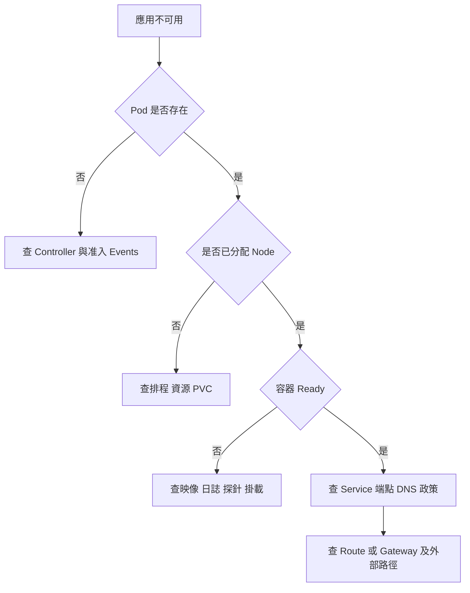

## 症狀與證據表

| 症狀 | 優先證據 | 常見根因 | 恢復後要驗收 |
|---|---|---|---|
| Pending | describe、nodeName、PVC | 資源不足、taint、不符 affinity、儲存限制 | 能排上節點且 Ready |
| ImagePullBackOff | Events | 名稱／tag、權限、CA、Registry 網路 | 映像可拉且應用可啟動 |
| CrashLoopBackOff | logs、previous、exit code | 主程序結束、錯誤設定、探針殺掉 | 重啟次數停止增加 |
| OOMKilled | lastState、資源圖表 | limit 太低、記憶體洩漏 | 負載下仍有餘裕 |
| Running 但不 Ready | 探針與應用日誌 | 探測路徑／port 錯、啟動未完成 | EndpointSlice ready 狀態 |
| Service 不通 | selector、端點、port | 標籤錯、空後端、NetworkPolicy | Pod 內用 Service 名稱可連 |
| PVC Pending | PVC Events、StorageClass | 無適合 PV、供應失敗、等待消費者 | Bound 且實際可讀寫 |
| Forbidden | 錯誤訊息、auth can-i | RBAC、平台政策；建立 Pod 時也可能是 SCC | 對應動作最小權限成功 |
| Route 503 | 後端 Ready、Route 狀態 | Router 無可用後端、port／TLS 不符 | 外部 Host 與 TLS 存取成功 |
| Node NotReady | Node conditions、kubelet、runtime | 心跳、執行環境、網路或主機問題 | 節點及業務均恢復 |

## 每次都能用的命令

```bash
kubectl -n k8s-book-lab get pods -o wide
kubectl -n k8s-book-lab describe deployment web
kubectl -n k8s-book-lab get events --sort-by=.metadata.creationTimestamp
kubectl -n k8s-book-lab logs deployment/web -c nginx --tail=100
kubectl -n k8s-book-lab get svc,endpointslices
```

查特定故障 Pod 時，將 `<pod>` 換成實際名稱：

```bash
kubectl -n k8s-book-lab describe pod <pod>
kubectl -n k8s-book-lab logs <pod> -c nginx --previous --tail=100
kubectl -n k8s-book-lab get pod <pod> -o yaml
```

`--previous` 沒有資料可能是沒有前一個容器實例或日誌已不存在，不能當成「從未故障」。多副本時看 `deployment/web` 的日誌也不能保證涵蓋所有副本，應找到真正出問題的 Pod。

**事件紀錄模板：**時間與時區、受影響入口、預期／實際結果、版本、Pod UID／Node、最近變更、Events、相關日誌、已排除假設、修復動作、驗收結果。避免先重啟再蒐證，否則可能失去最重要的現場資訊。

# 第 12 章 新功能與今日的延伸方向

**來源：PDF 1499–1562。核心問題：新功能解決的是哪一類工作負載需求？**

## 原書各節精華與更新

| 原書節 | 原書主題 | 現在應掌握的內容 |
|---|---|---|
| 12.1 Windows 容器 | 混合 OS 叢集 | Windows Node 執行相容 Windows 映像；控制平面使用 Linux；依版本查 OS 支援 |
| 12.2 GPU | 讓工作負載申請加速器 | 硬體驅動、device plugin／廠商整合、資源名稱、排程與監控 |
| 12.3 VPA | 自動調整 Pod 資源 | 先看建議，再決定 Off／Initial／Recreate／原地調整；與 HPA 指標協調 |
| 12.4 生態與演進 | 路線圖與社群 | 讀 feature state、KEP、版本發布與移除公告；不要把 Alpha 當跨平台保證 |

## Windows 不等於把整台 Windows VM 放入 Pod

傳統 Windows Server 上的 GUI、系統服務與驅動不能直接假設可搬進容器。先確認應用是否支援 Windows Container、基底映像與 host OS 相容，再以 `kubernetes.io/os: windows` 等條件選節點。最新上游文件目前列 Server 2022／2025；企業發行版可能有不同限制。[Windows 官方文件](https://kubernetes.io/docs/concepts/windows/intro/)

Windows 主機用 AWX 安裝 Vector 服務，是「主機設定自動化」；在 Kubernetes 以 DaemonSet 管理容器代理程式，是「叢集工作負載管理」。兩者可以共存，適用對象與管理權限不同。

## GPU 的完整條件

有 GPU 硬體不代表 Pod 已可使用。節點需要相容驅動與 runtime 整合，device plugin 把 GPU 宣告為可配置資源，Pod 再請求正確資源鍵，例如某些 NVIDIA 部署會使用 `nvidia.com/gpu`。需要確認整卡／共享／MIG 等模式，以及模型映像與 CUDA 等版本相容性。[GPU 排程](https://kubernetes.io/docs/tasks/manage-gpus/scheduling-gpus/)

## 三種擴容一起看

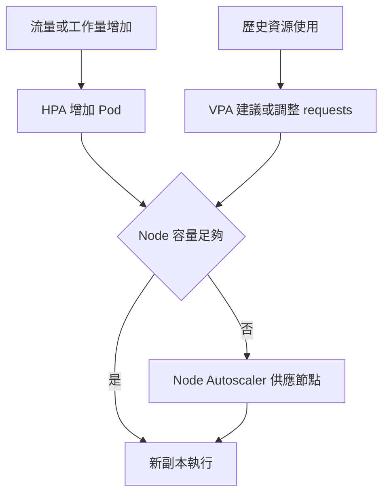

| 機制 | 改變什麼 | 前提 | 常見副作用 |
|---|---|---|---|
| HPA | Pod 副本數 | 指標來源、可水平擴充的應用 | 下游 DB 容量可能成瓶頸 |
| VPA | requests／適用的 limits | 安裝 VPA 與相容版本 | 依模式可能驅逐或重新啟動 |
| Node Autoscaler | Node 數量 | 基礎設施供應整合 | VM／硬體供應有延遲與配額 |

VPA `Off` 可先只產生建議。不要讓 HPA 的 CPU 使用率分母與 VPA 同時調整的 CPU request 彼此追逐而未做設計；可選用不同指標或先只用 VPA 建議模式。原地 resize 自 Kubernetes 1.35 穩定，但某次調整能否不重啟仍受資源種類、resizePolicy、節點容量與 VPA 模式限制。[VPA 模式](https://kubernetes.io/docs/concepts/workloads/autoscaling/vertical-pod-autoscale/)、[原地調整](https://kubernetes.io/docs/tasks/configure-pod-container/resize-container-resources/)

Node autoscaling 主要依待排程需求與 requests 等條件規劃容量，不單看 CPU 實際使用百分比；在自己的 vSphere／Proxmox 上，也要先有相應的自動供應整合，才可能自動新增 Node。[Node Autoscaling](https://kubernetes.io/docs/concepts/cluster-administration/node-autoscaling/)

## 值得再學的方向

- Gateway API：平台組管理入口、應用組管理路由，如何分工？
- GitOps：如何將臨時手動修復補回 Git，避免下一次同步覆蓋？
- Operator：哪些 DB 操作可以自動化，哪些仍需產品層復原演練？
- 供應鏈安全：Trivy 掃描、映像 digest、簽章、部署准入各自保護哪一段？
- 可觀測性：使用者抱怨慢，但 CPU 不高時，如何把 Metrics、Logs 與 Traces 串起來？

# 附錄 A 核心元件設定的閱讀方法

**來源：PDF 1563–1678。**原書的參數清單可用來理解分類，實際可用欄位應以目標版本及平台為準。不要把附錄當成可以整份複製的今日預設配置。

| 元件 | 優先理解的設定 | 驗證方式 |
|---|---|---|
| API Server | 認證、授權、准入、審計、etcd 連線 | 實際部署 manifest／設定 API、目標版本 help |
| Controller Manager | 控制器啟用、憑證、leader election | 平台管理的配置與日誌 |
| Scheduler | profiles、外掛、leader election | 設定檔、FailedScheduling 原因 |
| kubelet | runtime、資源保留、驅逐、靜態 Pod | KubeletConfiguration 與節點日誌 |
| Service 資料平面 | 模式、網段、轉送規則 | 實際 CNI／kube-proxy 實作 |

**平台差異：**在 Operator 管理的 OKD 中直接修改底層檔案可能被協調回去，或破壞平台支援方式。應透過對應 Operator 的受支援設定介面操作。

# 實作課程 A 到 J

## 共用前提與檔案

在自己的實驗叢集或經允許的測試 Namespace 操作。本文沒有執行任何公司環境變更。下載實作包並解壓縮，在包含 `labs` 的目錄開啟終端機。`kubectl` 範例採 Bash／一般 shell 語法；OKD 可使用已登入的 `oc` 替換大部分 kubectl 操作。

- 基本實驗：能建立 Namespace 或由管理者建立 `k8s-book-lab`；能在其中操作 Deployment、ConfigMap、Service、Pod。
- E：CNI 實作 NetworkPolicy。G：可用 StorageClass 與 1 GiB 測試空間。I：可用 Metrics API。
- 範例映像採官方專案提供的 `docker.io/nginxinc/nginx-unprivileged:stable-alpine`。這是方便入門的可變標籤，不代表已通過你的弱掃或公司核准；正式使用應經 Harbor 與掃描流程，固定核准 digest。
- 叢集若無外網，先將映像匯入核准 Registry，再替換所有 YAML 的 image 欄位。平台如果有額外准入政策，依政策補齊，不直接放寬整個叢集。
- `kubectl apply --dry-run=server -f ...` 會連 API 做驗證但不保存物件；依賴物件仍需先存在。Namespace 要先建立再驗證命名空間內資源。

來源：[非特權 NGINX 映像專案](https://github.com/nginx/docker-nginx-unprivileged)。

| 檔案 | 內容 | 用於 |
|---|---|---|
| 00-namespace.yaml | 獨立實驗 Namespace | A |
| 01-web.yaml | ConfigMap、Deployment、Service | A～D、H～J |
| 02-clients.yaml | 允許來源與其他來源的測試 Pod | D、E |
| 03-networkpolicy.yaml | 只允許指定來源存取 Web | E |
| 04-rbac.yaml | ServiceAccount、Role、RoleBinding | F |
| 05-pvc.yaml | 1 GiB PVC | G |
| 06-pvc-writer.yaml | 使用 PVC 的測試 Pod | G |
| 07-hpa.yaml | autoscaling/v2 HPA | I |
| 08-pdb.yaml | policy/v1 PDB | I |
| 09-cronjob.yaml | 預設暫停的 CronJob | J |

## A 建立兩副本 NGINX

**學習目的：**把 Deployment、Pod、ConfigMap、Service、探針與資源限制串起來。

```bash
kubectl config current-context
kubectl apply -f labs/00-namespace.yaml
kubectl apply --dry-run=server -f labs/01-web.yaml
kubectl apply -f labs/01-web.yaml
kubectl -n k8s-book-lab rollout status deployment/web --timeout=180s
kubectl -n k8s-book-lab get deploy,rs,pods,svc
kubectl -n k8s-book-lab port-forward svc/web 8080:80
```

最後一條會持續佔用目前終端機；用瀏覽器開啟 `http://localhost:8080`，預期看到 **Kubernetes Lab v1**。完成後按 Ctrl+C 停止 port-forward。

若沒有建立 Namespace 的權限，在 OKD 可依平台權限使用 `oc new-project k8s-book-lab`，或請管理者提供相同測試範圍；不要往既有正式專案套用。

**看懂 YAML：**Deployment selector 與 Pod label 都是 `app: web`；Service 用同一 selector 選取。Service 80 對到具名 port `http`，再對到容器 8080。唯讀根檔案系統之外，用 emptyDir 提供 `/tmp`；NGINX 設定將 pid 與暫存寫入此處。

**成功證據：**Deployment Ready 為 2/2；兩個 Pod Ready；畫面文字正確。若 SCC／PSS 拒絕，先讀 Events；若 ImagePullBackOff，先查映像與 Registry。

## B 觀察自動補副本

```bash
kubectl -n k8s-book-lab get pods -l app=web -o wide
```

記下一個 Pod 的名稱，刪除「一個」實驗 Pod：

```bash
kubectl -n k8s-book-lab delete pod <剛剛記下的Pod名稱>
kubectl -n k8s-book-lab get pods -l app=web -w
```

看到新 Pod 產生並回到兩副本後，Ctrl+C 停止 watch。比較新舊 UID：這是替代物件，不是原 Pod 被搬家。

**延伸：**單一 Node 實驗仍可證明控制器補副本，但不能證明跨 Node 容錯。要測 Node 故障，需要多節點、足夠容量、分散規則與相應儲存支援。

## C 模擬錯誤版本並回滾

先保留目前 rollout history；此實驗在基礎部署健康且尚未交給 GitOps 管理時執行。

```bash
kubectl -n k8s-book-lab rollout history deployment/web
kubectl -n k8s-book-lab set image deployment/web nginx=docker.io/nginxinc/nginx-unprivileged:book-lab-no-such-tag-20260916
kubectl -n k8s-book-lab rollout status deployment/web --timeout=60s
kubectl -n k8s-book-lab get pods
kubectl -n k8s-book-lab get events --sort-by=.metadata.creationTimestamp
```

預期新 Pod 拉取不存在標籤失敗，rollout timeout。由於 `maxUnavailable: 0`，健康的舊副本通常保留；因此部署更新失敗與整個網站立即斷線是不同事情。

```bash
kubectl -n k8s-book-lab rollout undo deployment/web
kubectl -n k8s-book-lab rollout status deployment/web --timeout=180s
```

**成功證據：**映像恢復、更新完成、後端 Ready。GitOps 環境通常應 revert Git 中的映像變更，再同步；資料庫 migration 的回滾需另設方案。

## D 修復 Service selector

先建立測試用戶端，從 Pod 內驗證 Service：

```bash
kubectl apply -f labs/02-clients.yaml
kubectl -n k8s-book-lab wait --for=condition=Ready pod/client-allowed pod/client-other --timeout=180s
kubectl -n k8s-book-lab exec client-allowed -- wget -T 5 -qO- http://web
```

應看到網站 HTML。故意把 selector 改錯：

```bash
kubectl -n k8s-book-lab patch svc web --type=merge -p '{"spec":{"selector":{"app":"wrong"}}}'
kubectl -n k8s-book-lab get endpointslices -l kubernetes.io/service-name=web -o yaml
kubectl -n k8s-book-lab exec client-allowed -- wget -T 5 -qO- http://web
```

等控制器更新後，應看不到匹配的可用後端，連線失敗。恢復：

```bash
kubectl -n k8s-book-lab patch svc web --type=merge -p '{"spec":{"selector":{"app":"web"}}}'
kubectl -n k8s-book-lab get endpointslices -l kubernetes.io/service-name=web -o yaml
kubectl -n k8s-book-lab exec client-allowed -- wget -T 5 -qO- http://web
```

**成功證據：**Pod 始終健康，但改錯 selector 時 Service 失敗、恢復後成功。這讓你能辨別應用故障與服務發現故障。

## E NetworkPolicy 允許與拒絕

先確認 D 的兩個用戶端都可存取，再套用政策：

```bash
kubectl apply -f labs/03-networkpolicy.yaml
kubectl -n k8s-book-lab exec client-allowed -- wget -T 5 -qO- http://web
kubectl -n k8s-book-lab exec client-other -- wget -T 5 -qO- http://web
```

第一個預期成功，第二個預期失敗。政策只允許相同 Namespace、`role: client` 的來源到 Web Pod TCP 8080。注意規則寫的是後端 port 8080；此實驗的流量路徑明確，其他有 NAT 或外部來源情境須看外掛實作。

**復原：**此政策也可能阻止 Router 存取 Web，所以測外部 Route 前先移除實驗政策，或另設符合平台的 Router allow 規則。

```bash
kubectl -n k8s-book-lab delete networkpolicy web-only-from-client
```

## F 最小權限

```bash
kubectl apply -f labs/04-rbac.yaml
kubectl auth can-i list pods -n k8s-book-lab --as=system:serviceaccount:k8s-book-lab:log-reader
kubectl auth can-i delete pods -n k8s-book-lab --as=system:serviceaccount:k8s-book-lab:log-reader
```

**預期：**第一項 yes，第二項 no。若執行者本身不能 impersonate，錯誤是在測試方法的權限，不是 Role 一定寫錯；請具備相應權限者執行查詢。此帳號不應再同時綁定額外的寬權限角色，否則測試結論會不同。

## G PVC 持久性

先執行 `kubectl get storageclass`。`05-pvc.yaml` 未指定 StorageClass，依賴叢集預設值；若沒有預設值，請在 `spec.storageClassName` 填入管理者提供的名稱。

`06-pvc-writer.yaml` 的 `fsGroup: 101` 是一般 Kubernetes 範例。**在 OKD 先移除此行，讓 SCC 依專案範圍分配；**實際能否寫入也取決於 CSI 與檔案系統權限，不能直接給 root 來跳過原因。

```bash
kubectl apply -f labs/05-pvc.yaml
kubectl apply -f labs/06-pvc-writer.yaml
kubectl -n k8s-book-lab get pvc
kubectl -n k8s-book-lab wait --for=condition=Ready pod/pvc-writer --timeout=180s
kubectl -n k8s-book-lab exec pvc-writer -- sh -c 'echo persistence-test > /data/proof.txt; cat /data/proof.txt'
kubectl -n k8s-book-lab delete pod pvc-writer --wait=true
kubectl apply -f labs/06-pvc-writer.yaml
kubectl -n k8s-book-lab wait --for=condition=Ready pod/pvc-writer --timeout=180s
kubectl -n k8s-book-lab exec pvc-writer -- cat /data/proof.txt
```

**預期：**重建後仍看到 `persistence-test`。若 PVC 等待首次消費者，建立 Pod 後再觀察綁定；若 Permission denied，查 Volume 權限、SCC 及 CSI 對 fsGroup 的處理。

## H 設定更新與探針失敗

更新 ConfigMap 的首頁：

```bash
kubectl -n k8s-book-lab patch configmap web-config --type=merge -p '{"data":{"index.html":"<h1>Kubernetes Lab v2</h1>"}}'
```

首頁以目錄掛載，通常會在投射更新後看到變更，不保證立即；若應用有快取也需處理。`nginx.conf` 使用 subPath 掛載，無法靠投射機制直接收到更新，修改它後需重建 Pod 並使 NGINX 讀新設定。[ConfigMap 更新行為](https://kubernetes.io/docs/concepts/configuration/configmap/)

```bash
kubectl -n k8s-book-lab rollout restart deployment/web
kubectl -n k8s-book-lab rollout status deployment/web --timeout=180s
```

接著故意把新版本的 readiness 路徑改錯：

```bash
kubectl -n k8s-book-lab patch deployment web --type=json -p '[{"op":"replace","path":"/spec/template/spec/containers/0/readinessProbe/httpGet/path","value":"/not-ready"}]'
kubectl -n k8s-book-lab get pods
kubectl -n k8s-book-lab describe deployment web
```

預期新 Pod 可能 Running 但不 Ready，更新停住，舊副本仍可能服務。恢復：

```bash
kubectl -n k8s-book-lab rollout undo deployment/web
kubectl -n k8s-book-lab rollout status deployment/web --timeout=180s
```

注意 rollout undo 不會把同名 ConfigMap 的 v2 內容一併還原。這正好展示「Pod template 版本」與「外部設定內容」是不同的版本管理問題。

## I 觀察 HPA 與 PDB

```bash
kubectl top pods -n k8s-book-lab
kubectl apply -f labs/07-hpa.yaml
kubectl apply -f labs/08-pdb.yaml
kubectl -n k8s-book-lab get hpa,pdb
kubectl -n k8s-book-lab describe hpa web
```

HPA 能取得指標、目標 reference 正確且副本在 2～5 範圍，是基本驗收。靜態網站無負載時不會因為建立 HPA 就自動增加副本。要證明擴容，另在核准測試環境施加可控負載，記錄 CPU／request、desiredReplicas、Ready 副本與回應延遲。

PDB 的 `minAvailable: 1` 對兩副本實驗提供維護預算；這裡只觀察，不要求你對共用 Node 執行 drain。

HPA 存在時避免持續用 `apply` 把 Deployment replicas 固定回 2。回到手動練習前可先移除 HPA：

```bash
kubectl -n k8s-book-lab delete hpa web
```

## J Job 與外部入口

CronJob 檔案預設 `suspend: true`，避免讀者忘記清理後一直排程。先從它建立一次性 Job：

```bash
kubectl apply -f labs/09-cronjob.yaml
kubectl -n k8s-book-lab create job report-once --from=cronjob/report-demo
kubectl -n k8s-book-lab wait --for=condition=complete job/report-once --timeout=180s
kubectl -n k8s-book-lab logs job/report-once
```

預期輸出 UTC 時間與 `report-demo-complete`。重跑前刪除舊的 `report-once`，或換新名稱。理解 CronJob 產生 Job、Job 產生 Pod 的關係；TTL 設為完成後 600 秒清理 Job，請及時查看結果。

若在 OKD，並確認 E 的隔離政策已移除，可建立測試 Route：

```bash
oc -n k8s-book-lab create route edge web --service=web --port=http --insecure-policy=Redirect
oc -n k8s-book-lab get route web
oc -n k8s-book-lab describe route web
```

使用平台分配的 Host 測試 HTTPS。DNS、入口可達性與憑證信任須由平台提供；失敗時分別查 admitted 狀態、TLS 與後端端點，不以跳過驗證當成驗收完成。

## 清理

先確認 Namespace 內只有本教材測試物件，且 G 的檔案都是可刪除資料：

```bash
kubectl -n k8s-book-lab get deploy,pods,svc,configmap,pvc,hpa,pdb,networkpolicy,cronjob,job
kubectl delete namespace k8s-book-lab
```

刪除 Namespace 會刪掉其中 PVC，若 PV 回收政策為 Delete，底層測試資料也可能隨之刪除。保留資料的需求應先完成備份與回收政策處理。

# 綜合案例 把 CI CD 與維運串成完整系統

這是依你熟悉的工具設計的教學案例，不代表公司所有元件目前都已按此架構完成設定。

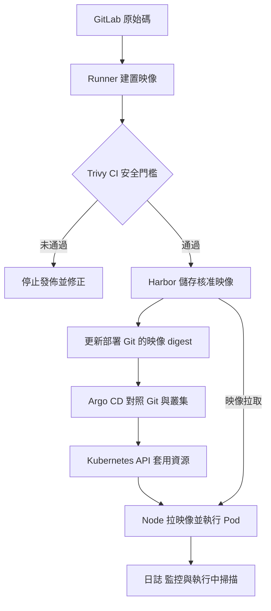

這裡「Harbor → 更新 Git」是 pipeline 接續執行的動作，不是 Harbor 會自動改 Git。Argo CD 一般是比較 Git 宣告與叢集狀態；只推送新映像到 Harbor，不會保證 Deployment 的 image 欄位自動改變。若要自動選新版本，還需明確的映像更新流程。[Argo CD](https://argo-cd.readthedocs.io/en/stable/)

Trivy CI 掃描決定這次建置是否可以發佈；Trivy Operator 可產生叢集工作負載映像的漏洞報告，兩者處理不同時間點。Operator 報告不是天然的部署阻擋政策，新漏洞資料也可能讓先前通過的映像後來被報出漏洞。[Trivy Operator](https://aquasecurity.github.io/trivy-operator/latest/)

| 情境 | 對應章節 | 你應採取的動作 |
|---|---|---|
| Pipeline 成功，但新畫面沒出現 | 3、9、10 | 查 Git digest、Argo Sync、Deployment template、Pod imageID 與快取 |
| Argo Synced，但 Pod 不 Ready | 3、5、11 | 查 runtime 狀態、探針、Events；Synced 不等於業務健康 |
| Pod 正常，Route 503 | 4、7、11 | 查 Service selector、端點、Router 到後端與 TLS |
| 擴副本後資料不一致 | 3、8 | 查應用是否無狀態、session、共享檔案與 DB 複寫設計 |
| Node 維護造成停機 | 3、10 | 查副本分散、容量、PDB、graceful shutdown |
| Vector 連不上後端 | 7、10 | 查 DNS、egress、TLS、認證、緩衝及重試 |
| 災後只有 YAML 恢復 | 8、10 | 查 PVC／DB 備份與還原，不只查 Git 或 etcd |

# 十次學習安排與驗收

每次可先用 90 分鐘學習與操作，再用 15 分鐘回顧、15 分鐘記錄證據。這是入門到可操作的建議節奏，並不表示二十小時即可取得生產叢集管理的完整能力。

| 次數 | 學習內容 | 動手做 | 你要留下的成果 |
|---|---|---|---|
| 1 | 第 1 章＋第 2 章環境辨識 | A | 平台元件與物件關係圖 |
| 2 | 第 3 章生命週期、控制器 | B、C | 新舊 Pod UID 與更新記錄 |
| 3 | 第 4 章 Service 與 DNS | D | Service selector 與端點對照 |
| 4 | 第 5、7 章元件與網路 | E | 允許／拒絕測試表 |
| 5 | 第 6 章安全 | F | RBAC 權限矩陣 |
| 6 | 第 8 章儲存 | G | Pod 重建前後檔案驗證 |
| 7 | 第 3、10 章設定與維運 | H | ConfigMap 與 rollout 差異 |
| 8 | 第 10、12 章資源與擴容 | I | requests／limits／HPA 判讀 |
| 9 | 第 9、11 章 API 與排錯 | 唯讀 API＋重做一項故障 | 一份有證據的事件報告 |
| 10 | 第 12 章＋綜合案例 | J＋全流程口述 | CI/CD、服務、資料、觀測總圖 |

## 十題理解檢查與答案

1. **Deployment 是執行中的容器嗎？**不是；它管理 Pod template、ReplicaSet 與副本生命週期。
2. **Pod 刪掉後為什麼回來？**因為控制器發現副本低於期望值；單獨建立的裸 Pod 不具有同樣的替代保證。
3. **Running 為什麼仍可能無法服務？**Ready、port、應用功能、網路與入口仍可能有問題。
4. **加 CPU limit 可以解決所有 Pending 嗎？**不能；排程主要要看 requests 與其他約束，且提高 limit 可能不改變可排程性。
5. **RWO 是否表示只能一個 Pod？**不一定，是單 Node 的讀寫掛載語意；RWOP 才是單 Pod 的相應機制。
6. **PDB 能保證 Node 斷電不掉服務嗎？**不能；需應用副本、跨故障域分散與底層可用性共同支援。
7. **Secret 的 Base64 是加密嗎？**不是，需另處理靜態加密與權限。
8. **CRD 建好等於 Operator 已正常運作嗎？**不是；還要 Controller 與正確權限、設定及狀態。
9. **HPA 擴到 5，但只有 2 個 Running，合理嗎？**合理；可能是節點容量、儲存或排程條件不足。
10. **Git 中有 YAML 就有完整備份嗎？**沒有；應用資料、機密、映像與外部依賴仍需另行保護。

# 下一步值得深入的問題

1. 為什麼同樣兩副本，有些系統能不中斷更新，有些會中斷？從 readiness、連線排空、session、DB migration 與容量比較。
2. 適合把哪些 VM 工作負載移到 Kubernetes，哪些保留 VM？從狀態、授權、OS 依賴、部署頻率與維運能力判斷。
3. 如何定義「備份還原成功」？把可建立 Pod、資料正確、服務可用、RPO／RTO 達標分成不同驗收項。
4. 平台工程師要暴露多少 Kubernetes 細節給應用團隊？可以用範本、GitOps、配額與 Operator 建立標準，但仍需保留可診斷性。
5. 如何證明弱掃通過的就是實際執行映像？串起 CI 產物 digest、Harbor digest、Git image 欄位與 Pod imageID。

# 來源與閱讀範圍

- 原書：龔正等，《Kubernetes權威指南：從Docker到Kubernetes實踐全接觸》，電子工業出版社，2021 年 6 月，ISBN 9787121409981；使用本次附件的書籤、目錄與各章可擷取內文。
- 全章範圍：12 章、原書全部第二層節目錄與附錄 A；第三層細節整合在主題教學中，沒有逐段翻譯或複製原書圖表。
- 新版查核來源：各章的 Kubernetes、OKD、Argo CD、Helm、NGINX、Trivy 官方連結。版本敏感內容均以查核日可取得的文件為準；部署時再對照目標叢集版本。
- 圖表中的 HPA／容量數字是教學假設，並非實測效能；架構圖是責任及關係的簡化表示。


# 實作 YAML 完整內容

以下檔案與實作包 labs 目錄一致。先依實驗 A 到 J 的順序閱讀前提與恢復方法，再執行；不要一次對整個 labs 目錄 apply。

## 00-namespace.yaml

```yaml
apiVersion: v1
kind: Namespace
metadata:
  name: k8s-book-lab
```

## 01-web.yaml

```yaml
apiVersion: v1
kind: ConfigMap
metadata:
  name: web-config
  namespace: k8s-book-lab
data:
  nginx.conf: |
    worker_processes auto;
    pid /tmp/nginx.pid;
    error_log /dev/stderr notice;
    events { worker_connections 1024; }
    http {
      include /etc/nginx/mime.types;
      default_type application/octet-stream;
      access_log /dev/stdout;
      client_body_temp_path /tmp/client_temp;
      proxy_temp_path /tmp/proxy_temp;
      fastcgi_temp_path /tmp/fastcgi_temp;
      uwsgi_temp_path /tmp/uwsgi_temp;
      scgi_temp_path /tmp/scgi_temp;
      server {
        listen 8080;
        root /usr/share/nginx/html;
        index index.html;
        location / { try_files $uri $uri/ =404; }
        location = /healthz { access_log off; return 200 'ok'; }
      }
    }
  index.html: |
    <!doctype html><html><meta charset="utf-8"><h1>Kubernetes Lab v1</h1><p>Deployment + Service + ConfigMap</p></html>
---
apiVersion: apps/v1
kind: Deployment
metadata:
  name: web
  namespace: k8s-book-lab
spec:
  replicas: 2
  revisionHistoryLimit: 5
  strategy:
    type: RollingUpdate
    rollingUpdate:
      maxSurge: 1
      maxUnavailable: 0
  selector:
    matchLabels:
      app: web
  template:
    metadata:
      labels:
        app: web
    spec:
      automountServiceAccountToken: false
      securityContext:
        runAsNonRoot: true
        seccompProfile:
          type: RuntimeDefault
      containers:
      - name: nginx
        image: docker.io/nginxinc/nginx-unprivileged:stable-alpine
        imagePullPolicy: Always
        command:
        - nginx
        args:
        - -g
        - daemon off;
        ports:
        - name: http
          containerPort: 8080
        securityContext:
          allowPrivilegeEscalation: false
          readOnlyRootFilesystem: true
          capabilities:
            drop:
            - ALL
        resources:
          requests:
            cpu: 50m
            memory: 64Mi
          limits:
            cpu: 500m
            memory: 128Mi
        startupProbe:
          httpGet:
            path: /healthz
            port: http
          periodSeconds: 2
          failureThreshold: 30
        readinessProbe:
          httpGet:
            path: /
            port: http
          periodSeconds: 5
        livenessProbe:
          httpGet:
            path: /healthz
            port: http
          periodSeconds: 10
          failureThreshold: 3
        env:
        - name: POD_NAME
          valueFrom:
            fieldRef:
              fieldPath: metadata.name
        volumeMounts:
        - name: conf
          mountPath: /etc/nginx/nginx.conf
          subPath: nginx.conf
          readOnly: true
        - name: html
          mountPath: /usr/share/nginx/html
          readOnly: true
        - name: tmp
          mountPath: /tmp
      volumes:
      - name: conf
        configMap:
          name: web-config
          items:
          - key: nginx.conf
            path: nginx.conf
      - name: html
        configMap:
          name: web-config
          items:
          - key: index.html
            path: index.html
      - name: tmp
        emptyDir: {}
---
apiVersion: v1
kind: Service
metadata:
  name: web
  namespace: k8s-book-lab
spec:
  type: ClusterIP
  selector:
    app: web
  ports:
  - name: http
    port: 80
    targetPort: http
```

## 02-clients.yaml

```yaml
apiVersion: v1
kind: Pod
metadata:
  name: client-allowed
  namespace: k8s-book-lab
  labels:
    role: client
spec:
  automountServiceAccountToken: false
  securityContext:
    runAsNonRoot: true
    seccompProfile:
      type: RuntimeDefault
  containers:
  - name: client
    image: docker.io/nginxinc/nginx-unprivileged:stable-alpine
    command:
    - sh
    - -c
    - sleep 86400
    securityContext:
      allowPrivilegeEscalation: false
      readOnlyRootFilesystem: true
      capabilities:
        drop:
        - ALL
    resources:
      requests:
        cpu: 10m
        memory: 16Mi
      limits:
        cpu: 100m
        memory: 64Mi
---
apiVersion: v1
kind: Pod
metadata:
  name: client-other
  namespace: k8s-book-lab
  labels:
    role: other
spec:
  automountServiceAccountToken: false
  securityContext:
    runAsNonRoot: true
    seccompProfile:
      type: RuntimeDefault
  containers:
  - name: client
    image: docker.io/nginxinc/nginx-unprivileged:stable-alpine
    command:
    - sh
    - -c
    - sleep 86400
    securityContext:
      allowPrivilegeEscalation: false
      readOnlyRootFilesystem: true
      capabilities:
        drop:
        - ALL
    resources:
      requests:
        cpu: 10m
        memory: 16Mi
      limits:
        cpu: 100m
        memory: 64Mi
```

## 03-networkpolicy.yaml

```yaml
apiVersion: networking.k8s.io/v1
kind: NetworkPolicy
metadata:
  name: web-only-from-client
  namespace: k8s-book-lab
spec:
  podSelector:
    matchLabels:
      app: web
  policyTypes:
  - Ingress
  ingress:
  - from:
    - podSelector:
        matchLabels:
          role: client
    ports:
    - protocol: TCP
      port: 8080
```

## 04-rbac.yaml

```yaml
apiVersion: v1
kind: ServiceAccount
metadata:
  name: log-reader
  namespace: k8s-book-lab
---
apiVersion: rbac.authorization.k8s.io/v1
kind: Role
metadata:
  name: pod-log-reader
  namespace: k8s-book-lab
rules:
- apiGroups:
  - ''
  resources:
  - pods
  - pods/log
  verbs:
  - get
  - list
  - watch
---
apiVersion: rbac.authorization.k8s.io/v1
kind: RoleBinding
metadata:
  name: log-reader-binding
  namespace: k8s-book-lab
subjects:
- kind: ServiceAccount
  name: log-reader
  namespace: k8s-book-lab
roleRef:
  apiGroup: rbac.authorization.k8s.io
  kind: Role
  name: pod-log-reader
```

## 05-pvc.yaml

```yaml
apiVersion: v1
kind: PersistentVolumeClaim
metadata:
  name: lab-data
  namespace: k8s-book-lab
spec:
  accessModes:
  - ReadWriteOnce
  resources:
    requests:
      storage: 1Gi
```

## 06-pvc-writer.yaml

```yaml
apiVersion: v1
kind: Pod
metadata:
  name: pvc-writer
  namespace: k8s-book-lab
  labels:
    role: storage
spec:
  automountServiceAccountToken: false
  securityContext:
    runAsNonRoot: true
    seccompProfile:
      type: RuntimeDefault
    fsGroup: 101
  containers:
  - name: writer
    image: docker.io/nginxinc/nginx-unprivileged:stable-alpine
    command:
    - sh
    - -c
    - sleep 86400
    securityContext:
      allowPrivilegeEscalation: false
      readOnlyRootFilesystem: true
      capabilities:
        drop:
        - ALL
    resources:
      requests:
        cpu: 10m
        memory: 16Mi
      limits:
        cpu: 100m
        memory: 64Mi
    volumeMounts:
    - name: data
      mountPath: /data
  volumes:
  - name: data
    persistentVolumeClaim:
      claimName: lab-data
```

## 07-hpa.yaml

```yaml
apiVersion: autoscaling/v2
kind: HorizontalPodAutoscaler
metadata:
  name: web
  namespace: k8s-book-lab
spec:
  scaleTargetRef:
    apiVersion: apps/v1
    kind: Deployment
    name: web
  minReplicas: 2
  maxReplicas: 5
  metrics:
  - type: Resource
    resource:
      name: cpu
      target:
        type: Utilization
        averageUtilization: 60
```

## 08-pdb.yaml

```yaml
apiVersion: policy/v1
kind: PodDisruptionBudget
metadata:
  name: web
  namespace: k8s-book-lab
spec:
  minAvailable: 1
  selector:
    matchLabels:
      app: web
```

## 09-cronjob.yaml

```yaml
apiVersion: batch/v1
kind: CronJob
metadata:
  name: report-demo
  namespace: k8s-book-lab
spec:
  schedule: '*/5 * * * *'
  suspend: true
  concurrencyPolicy: Forbid
  successfulJobsHistoryLimit: 1
  failedJobsHistoryLimit: 1
  jobTemplate:
    spec:
      backoffLimit: 1
      ttlSecondsAfterFinished: 600
      template:
        spec:
          automountServiceAccountToken: false
          securityContext:
            runAsNonRoot: true
            seccompProfile:
              type: RuntimeDefault
          restartPolicy: OnFailure
          containers:
          - name: report
            image: docker.io/nginxinc/nginx-unprivileged:stable-alpine
            command:
            - sh
            - -c
            - date -u; echo report-demo-complete
            securityContext:
              allowPrivilegeEscalation: false
              readOnlyRootFilesystem: true
              capabilities:
                drop:
                - ALL
            resources:
              requests:
                cpu: 10m
                memory: 16Mi
              limits:
                cpu: 100m
                memory: 64Mi
```
